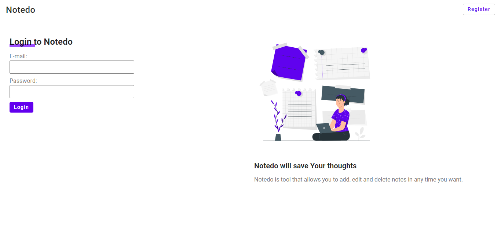

# Notedo

Notedo is tool that allows you to add, edit and delete notes in any time you want.
[Notedo site](https://notedo.netlify.app/)

## Installation

1. Clone repo and install dependencies

```bash
   git clone https://github.com/piotrglodek/notedo.git
   cd notedo
   npm install

```

2. Create account in [firebase](http://firebase.google.com/)
3. Create firebase project, enable sign-in-method via email/password
4. Create index:
   - Go to the <b>Cloud Firestore</b> section of the Firebase console.
   - Go to the <b>Indexes</b> tab and click <b>Add Index</b>.
   - Set:
     - collection id: notes
     - field path: userId ASC and date ASC
   - <b>Click Create.</b>
5. Create in root directory file `.env.local` and inside write

- REACT_APP_APIKEY=`your firebase config api`
- REACT_APP_AUTHDOMAIN=`your firebase config api`
- REACT_APP_PROJECTID=`your firebase config api`
- REACT_APP_STORAGEBUCKET=`your firebase config api`
- REACT_APP_MESSAGINGSENDERID=`your firebase config api`
- REACT_APP_APPID=`your firebase config api`

4. Run with npm: `npm start`
5. Open `http://localhost:3000` in your browser, and voilà.

## Tech Stack

- React
- Redux, Redux Toolkit
- React-router-dom
- Framer-motion
- Moment
- Styled-components
- Firebase
- React-hook-form (yup)
- polished

## Preview



## What I want to fix

- add database [Firebase](https://firebase.google.com) ✔️
- add form validation by [Formik](https://formik.org) or [React-hook-form](https://react-hook-form.com/) ✔️
- add tests with [React Testing Library](https://testing-library.com/docs/react-testing-library/intro)
- add ARIA for better accessibility ✔️

### Contributing

Pull requests are welcome. For major changes, please open an issue first to discuss what you would like to change.

#### License

[MIT](https://choosealicense.com/licenses/mit/)
