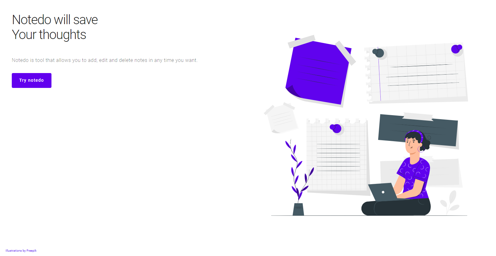
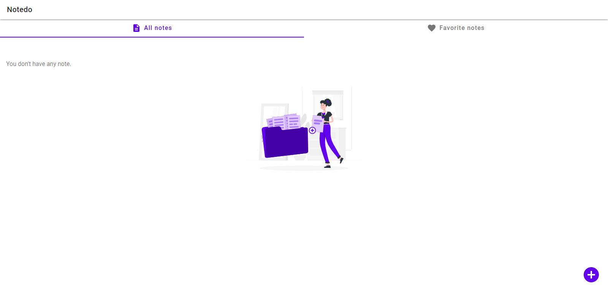
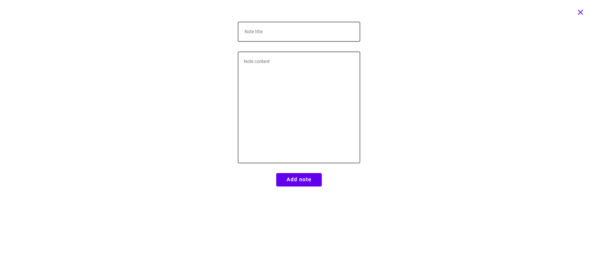
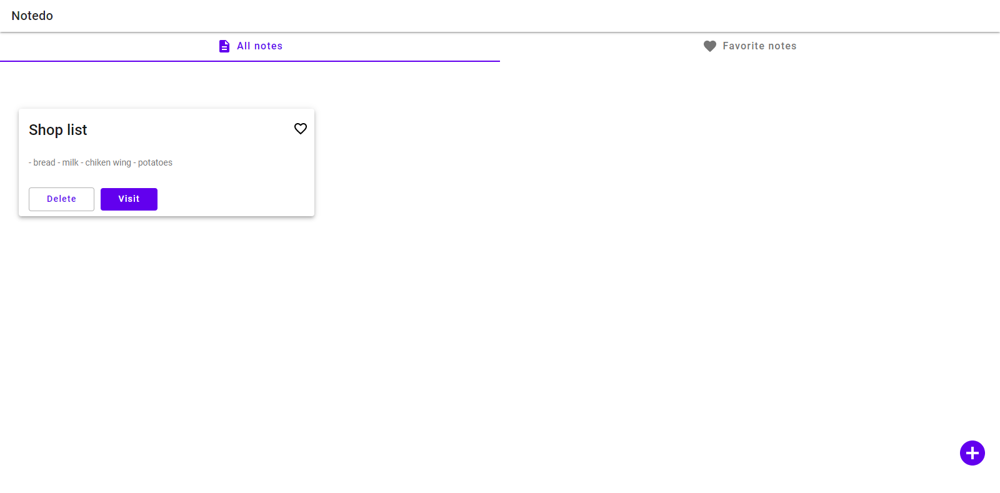
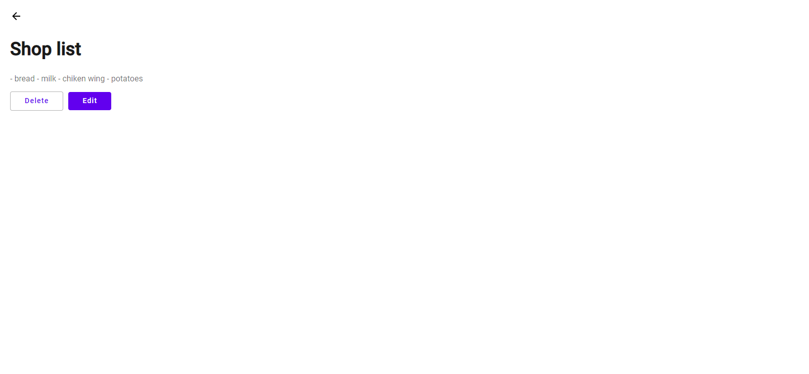
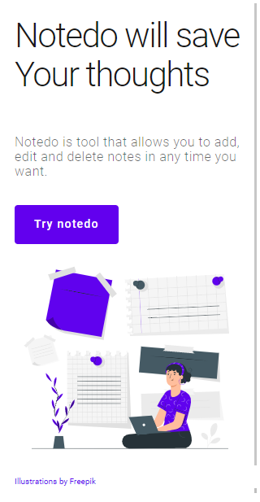
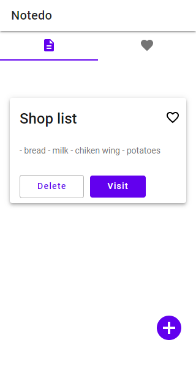
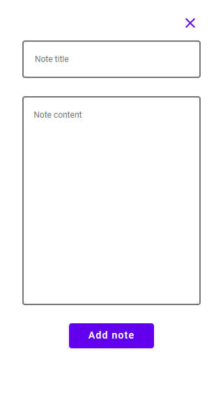
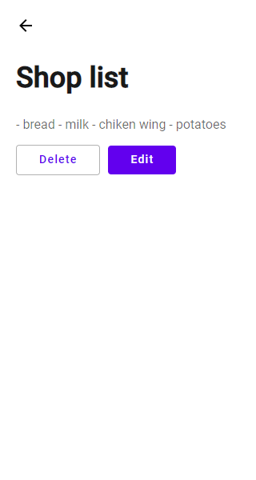

# Notedo

Notedo is tool that allows you to add, edit and delete notes in any time you want.
[Notedo site](https://notedo.netlify.app/)

## Installation

open cmd on your device and type in order:

```bash
git clone https://github.com/piotrglodek/notedo.git
cd notedo
npm install
npm start
```

App should automaticly open in browser localhost:[port]

## Tech Stack

- React
- Redux, Redux Toolkit
- React-router-dom
- Node-sass (scss)

## Preview

Desktop views

 
 




Mobile views

 




## What I want to fix

- add database [Firebase](https://firebase.google.com)
- add form validation by [Formik](https://formik.org) or [React-hook-form](https://react-hook-form.com/)
- add tests with [React Testing Library](https://testing-library.com/docs/react-testing-library/intro)
- Tabs component render prop
- add ARIA for better accessibility

### Contributing

Pull requests are welcome. For major changes, please open an issue first to discuss what you would like to change.

#### License

[MIT](https://choosealicense.com/licenses/mit/)
